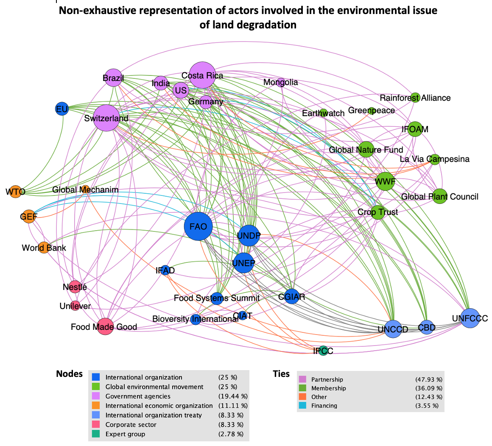

+++
author = ""
comments = false
date = "2021-05-12"
draft = false
image = ""
menu = ""
share = false
slug = "test"
title= "Who is acting and where?"
+++

Now, let's take a look at the map of the actors intervening in the land degradation institutional governance. [need to be re-worked]

The infographic below is giving an overview of the main actors involved in land degradation. Special focus is given to agriculture factors => give emphasize on the main cause of land degradation. How important this driver is. The only convention treating specifically about land degradation is UNCCD. 

 

